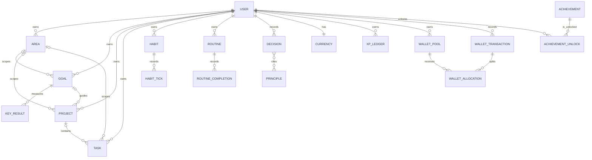

# LifeOS 数据库设计

> 本文描述当前 LifeOS 的持久化模型、数据边界和演进约定。数据库的唯一事实来源是 `prisma/schema.prisma`；本文用于帮助产品、前端和后端快速理解数据如何组织，而不是替代 Prisma schema 或 migration。

## 1. 概览

- **数据库**：PostgreSQL
- **ORM**：Prisma
- **Schema**：`prisma/schema.prisma`
- **迁移目录**：`prisma/migrations/`
- **主键**：除少量一对一和关联表外，使用应用生成的 `cuid` 字符串。
- **规模**：38 个模型，其中包括 Auth.js 所需的 4 张认证表。

LifeOS 以 `User` 为数据边界。所有用户私有业务实体均通过 `userId` 归属到一个用户；系统目录类实体使用稳定的 `key`，再由“用户拥有/解锁”关联表表达个人状态。

```text
User
 ├─ Area ─┬─ Goal ── KeyResult
 │        ├─ Project ── Task
 │        └─ Task / Habit / Routine / Decision / Note
 ├─ XP、货币、每日委托、复盘与财务数据
 ├─ 奖励、抽卡、成就、战令、活动和外观的个人状态
 └─ 原则库、决策日志与知识笔记
```

## 2. 建模约定

### 2.1 数据归属与删除行为

1. 用户私有表通常具有必填 `userId`，并以 `onDelete: Cascade` 删除：删除用户时清理其私有数据。
2. `Task`、`Project`、`Note` 等跨层对象对 `Area`、`Goal`、`Project` 的关联是可选的；父对象删除后关联使用 `onDelete: SetNull`，避免删除执行或知识历史。
3. 多对多和解锁关系使用独立关联表，并用复合唯一约束阻止重复写入。

### 2.2 时间、金额与状态

- 事件时刻使用 `DateTime`；按用户本地日/周聚合的键使用 `YYYY-MM-DD` 字符串，例如日程完成记录和战令周起始日。
- 财务金额统一以分为单位的整数保存（如 `amountCents`），避免浮点精度误差。
- 钱包资金池、流水类型和支出必要性使用 PostgreSQL enum；其余多数业务状态以字符串存储，并由 API 契约及业务逻辑校验。
- 大部分可编辑实体带有 `createdAt` 和 `updatedAt`；`updatedAt` 由 Prisma 自动维护。

### 2.3 JSON 文本字段

为了快速迭代，部分结构会以 JSON 字符串保存在 `String` 字段中：用户价值观、委托项目、复盘内容、战令任务、决策选项、活动任务、装备样式等。应用层负责序列化、校验和解析。

这类字段适合“整体读取、整体写回”的内容；若后续需要针对其内部属性做高频筛选、排序或聚合，应优先迁移为 PostgreSQL `Json` 字段，或拆分为子表。

## 3. 数据模型字典

### 3.1 身份与认证

| 表 | 主要字段 | 关系与约束 | 说明 |
|---|---|---|---|
| `User` | `email`、`name`、`class`、`timezone`、`avatarUrl`、愿景与偏好、精力与抽卡计数 | `email` 唯一；所有个人数据的根节点 | 兼具 Auth.js 用户资料和 LifeOS 角色档案 |
| `Account` | provider、provider account id、OAuth token 元数据 | 属于 User；`provider + providerAccountId` 唯一 | Auth.js 第三方登录账号 |
| `Session` | session token、过期时间 | 属于 User；`sessionToken` 唯一 | Auth.js 登录会话 |
| `VerificationToken` | identifier、token、过期时间 | `identifier + token` 唯一 | 邮箱验证 token |

`User` 的 LifeOS 扩展字段包括：人生愿景、核心价值观、身份宣言、个人偏好、当前装备的称号/相框、精力（resin）及抽卡保底计数。

### 3.2 人生规划与执行

| 表 | 主要字段 | 关系与约束 | 说明 |
|---|---|---|---|
| `Area` | 名称、图标、颜色、权重、健康分、属性标识与 XP | 属于 User；被 Goal、Project、Task、Habit、Routine、Decision、Note 引用 | 长期维护的人生领域 |
| `Goal` | objective、timeframe、起止日、状态、信心分 | 属于 User；可关联 Area；拥有 KeyResult、Project、Note | 个人 OKR 或里程碑 |
| `KeyResult` | 描述、单位、目标值、当前值、排序 | 属于 Goal | 可量化的 KR 进度 |
| `Project` | 标题、交付物、期限、状态、完成奖励 | 属于 User；可关联 Area 和 Goal；拥有 Task、Note | PARA 的 Project 层 |
| `Task` | 标题、状态、优先级、到期日、完成时间、XP/金币奖励 | 属于 User；可选关联 Area、Project；按用户+状态/到期日索引 | 一次性执行事项 |
| `Habit` | 标题、正负方向、累计次数、每次打卡奖励 | 属于 User；可选关联 Area | 可正向或负向计数的习惯 |
| `HabitTick` | 打卡方向、XP/金币变化、发生时间 | 属于 Habit；按习惯+时间索引 | 每次习惯打卡的历史流水 |
| `Routine` | 执行星期、连击、冻结次数、最后完成日期、奖励 | 属于 User；可选关联 Area | 周期性日程 |
| `RoutineCompletion` | 本地日期、创建时间 | 属于 Routine；`routineId + date` 唯一 | 防止同一天重复完成 |
| `DailyCommission` | 日期、4 个委托项、完成数、奖励领取状态 | 属于 User；`userId + date` 唯一 | 每日从任务/习惯/日程生成的委托快照 |
| `Review` | 类型、周期、内容、情绪/精力/专注评分 | 属于 User；按用户+类型+时间索引 | 日、周、月、季度复盘 |
| `Note` | 类型、标题、正文、来源、标签、置顶/归档 | 属于 User；可选关联 Area、Goal、Project | PARA-R 知识库与第二大脑 |

规划主链路是 `Area → Goal → Project → Task`。不过 Area 可以直接承接任务、习惯、日程、决策与笔记，避免用户必须经过完整的规划层级才能记录行动。

### 3.3 游戏化与奖励

| 表 | 主要字段 | 关系与约束 | 说明 |
|---|---|---|---|
| `XpLedger` | 数量、来源、来源 ID、属性 key、时间 | 属于 User；按用户+时间索引 | XP 获取历史，而非仅保存汇总值 |
| `Currency` | gold、gems、fate | 与 User 一对一，`userId` 为主键 | 当前虚拟货币余额 |
| `RewardItem` | 名称、价格、稀有度、抽卡权重、归档状态 | 属于 User；被兑换和抽卡记录引用 | 用户定义的真实奖励商品 |
| `RewardRedemption` | 花费、来源、状态、使用/丢弃时间、备注 | 属于 User 和 RewardItem；按用户+状态索引 | 已获得的奖励兑换券 |
| `GachaPull` | 奖励、稀有度、命运消耗、保底标记、时间 | 属于 User；奖励删除后保留记录并置空关联 | 抽卡历史与保底分析依据 |
| `StreakFreeze` | 库存、总使用次数 | 与 User 一对一，`userId` 为主键 | 连击保护卡库存 |
| `BattlePass` | 周起止日、总 XP、等级、任务快照、已领等级 | 属于 User；`userId + weekStart` 唯一 | 每周战令状态与历史 |
| `Achievement` | key、名称、条件、稀有度、奖励、拥有者 | `key` 唯一；拥有者为空时为系统目录 | 全局及用户自定义成就定义 |
| `AchievementUnlock` | 用户、成就、解锁时间 | `userId + achievementId` 唯一 | 用户的实际成就解锁记录 |
| `Title` | key、名称、档位、来源成就 key | `key` 唯一 | 全局称号目录 |
| `UserTitle` | 用户、称号 key、解锁时间 | `userId + titleKey` 唯一 | 用户拥有的称号 |
| `Equipment` | key、槽位、档位、来源、样式 | `key` 唯一 | 外观目录；当前主要实现头像相框 |
| `UserEquipment` | 用户、装备 key、解锁时间 | `userId + equipmentKey` 唯一 | 用户拥有的外观 |
| `Event` | key、时间范围、任务、全完成奖励、拥有者 | `key` 唯一；拥有者为空时为系统活动 | 限时活动定义 |
| `UserEventClaim` | 用户、活动、任务 key、领取时数据快照 | `userId + eventId + missionKey` 唯一 | 已领取的活动任务奖励 |

目录数据与用户状态分离是本区的核心：`Achievement`、`Title`、`Equipment`、`Event` 描述“系统提供什么”，对应的 `Unlock`、`UserTitle`、`UserEquipment`、`UserEventClaim` 描述“某用户已经获得什么”。

### 3.4 三资金池钱包

| 表 | 主要字段 | 关系与约束 | 说明 |
|---|---|---|---|
| `WalletPool` | 池类型、当前余额、币种 | 属于 User；`userId + type` 唯一 | 每月生活费、储蓄和流动资金三个用途池 |
| `WalletMonthlyPlan` | 月份、生活费目标、储蓄比例、是否沿用目标、初始化与结转状态 | 属于 User；`userId + month` 唯一 | 保存每月资金分配规则、目标沿用偏好与人工结转状态 |
| `WalletTransaction` | 类型、金额、必要性、源/目标池、对象、退款关联、备注、发生时间 | 属于 User；退款与原支出一对一；按用户+类型/必要性+时间索引 | 收入、支出、退款和池间资金调整的主流水 |
| `WalletAllocation` | 所属流水、资金池、有符号变动金额、变动后余额 | 属于 WalletTransaction 和 WalletPool | 解释一笔流水如何改变一个或多个资金池 |

`WalletPoolType` 包含 `living`、`savings`、`flexible`；`WalletTransactionType` 包含 `income`、`expense`、`refund`、`transfer`；`WalletNecessity` 包含 `essential`、`optional`。退款通过唯一的 `refundOfId` 关联原支出，保证一笔支出最多存在一条有效退款。旧账户、负债、信用卡、投资、分类与旧流水在三资金池迁移中清零，不计入新版钱包初始金额。

### 3.5 决策支持

| 表 | 主要字段 | 关系与约束 | 说明 |
|---|---|---|---|
| `Principle` | 标题、正文、来源、分类、使用次数、归档 | 属于 User；被 Decision 引用 | 个人原则库 |
| `Decision` | 背景、状态、风险等级、选项、预演失败、10-10-10、结果、教训、评分 | 属于 User；可选关联 Area；按状态和复盘截止时间索引 | 决策日志与事后复盘 |
| `DecisionPrinciple` | decision id、principle id | 复合主键；多对多关联 | 一次决策引用的原则集合 |

## 4. 关键关系图



## 5. 查询与索引策略

现有索引聚焦于应用中的高频筛选：

- 执行视图：`Task(userId, status)`、`Task(userId, dueDate)`、`Habit(userId)`、`Routine(userId)`。
- 时间线和分析：`XpLedger(userId, createdAt)`、`Review(userId, kind, createdAt)`、`WalletTransaction(userId, occurredAt)`。
- 进度与活动：`BattlePass(userId, weekStart)`、`AchievementUnlock(userId, unlockedAt)`、`UserEventClaim(userId, eventId)`。
- 知识库：`Note(userId, archived)`、`Note(userId, kind)` 及其对 Area/Goal/Project 的关联索引。

新增接口时应先按当前用户过滤，再按上述索引字段排序或筛选；不得用未加用户边界的查询读取私有表。

## 6. 迁移、初始化与日常操作

```bash
# 生成 Prisma Client
npm run db:generate

# 开发环境创建/应用迁移
npm run db:migrate

# 生产环境仅应用已提交迁移
npm run db:deploy

# 写入系统成就、称号、装备、活动等种子数据
npm run db:seed

# 连通性与 Prisma 查询检查
npm run db:check

# 打开 Prisma Studio
npm run db:studio
```

迁移应提交到 `prisma/migrations/`，不要手动修改已在其他环境执行过的 migration。模型字段变更的标准顺序是：更新 schema、生成 migration、审查 SQL、更新 API 契约/领域逻辑、补充测试、再部署迁移。

## 7. 演进建议

1. **JSON 查询需求增加时再规范化**：优先处理高频分析字段，例如活动任务进度、战令任务和复盘结构。
2. **明确字符串枚举的边界**：任务、项目、决策等状态目前由代码校验；当需要数据库级强约束或跨系统写入时，可逐步迁移为 enum。
3. **保持账本不可变性**：XP 与财务交易历史应优先追加记录，余额和统计值作为可重算的派生状态。
4. **维持用户隔离**：新增私有实体默认应有 `userId`、用户维度索引，以及明确的删除策略。
