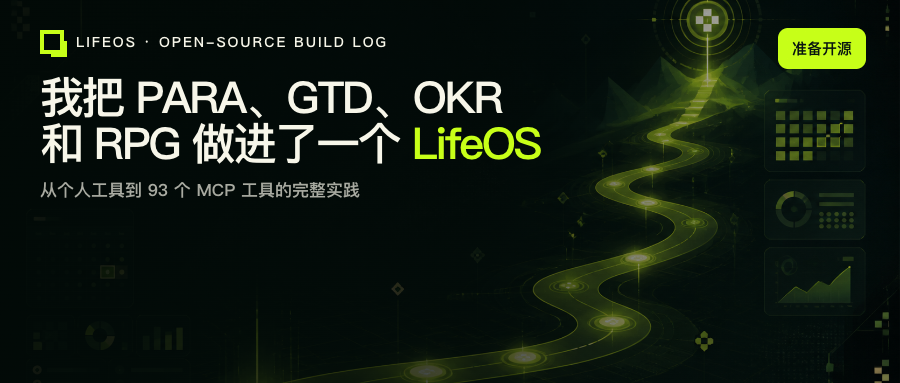
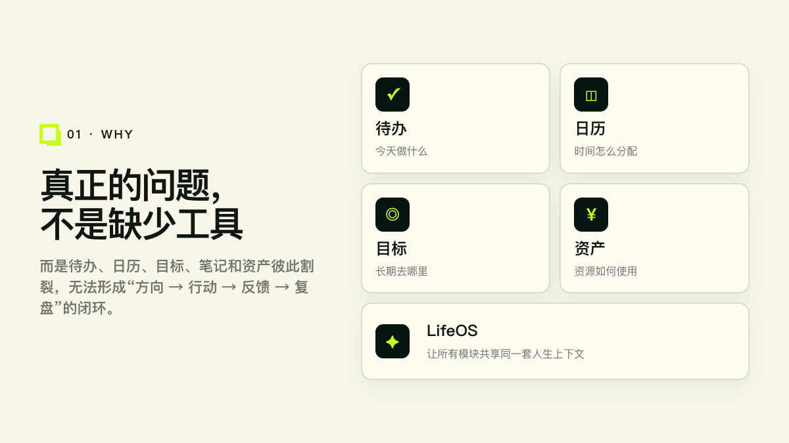
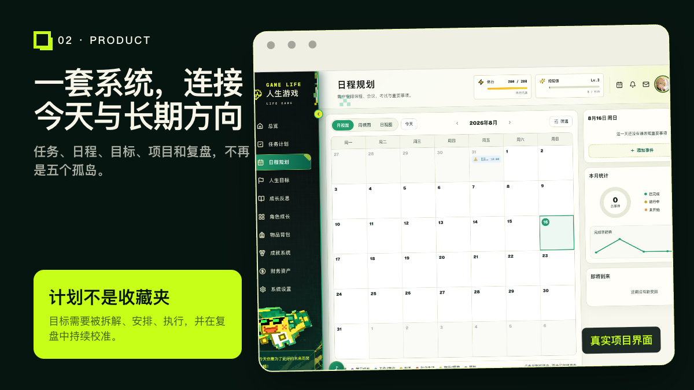
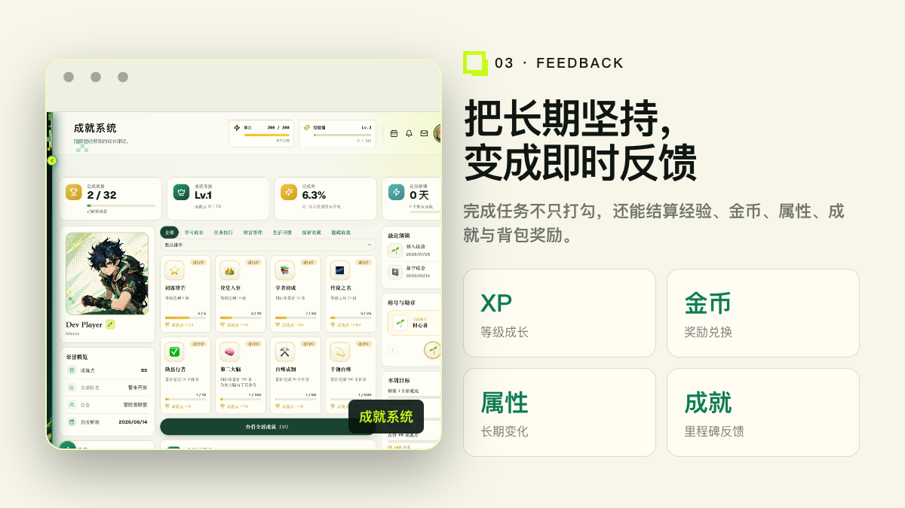
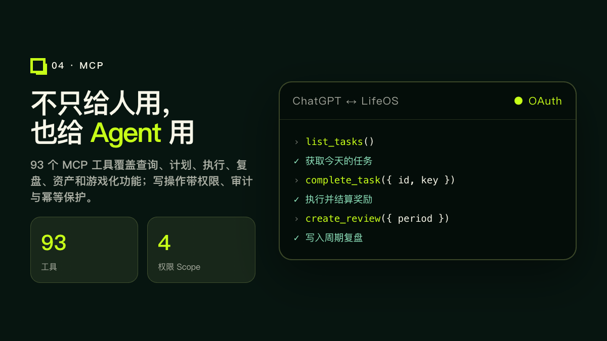
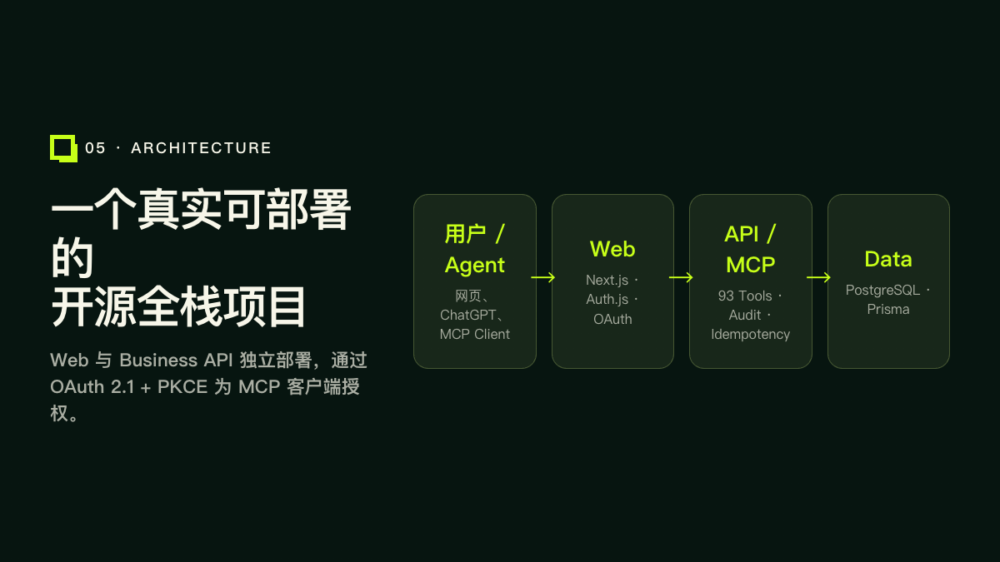

# 我把 PARA、GTD、OKR 和 RPG 做进了一个 LifeOS：从个人工具到 93 个 MCP 工具

> 开源地址：`https://github.com/Kunkun1234-1/lifeos`
> 在线体验：`https://lifeos-topaz-chi.vercel.app`

我做 LifeOS 的起点，并不是觉得市面上缺一个待办应用。

真正的问题是：我们拥有太多彼此割裂的工具。待办记录今天，日历分配时间，目标工具保存愿望，笔记沉淀知识，记账软件留下数字。每个工具都在自己的局部里成立，却很难回答一个更完整的问题——我今天做的事情，究竟如何影响长期方向？

## 一、问题不是缺少工具，而是缺少共同上下文

我希望构建的不是“更强的 Todo List”，而是一套能连接四个环节的个人系统：

1. 方向：人生领域、目标与关键结果。
2. 计划：项目、任务、日程与例行事项。
3. 执行：今天真正完成了什么。
4. 反馈：属性、成就、资产变化与周期复盘。

PARA 负责组织信息，GTD 负责把事情推进到下一步，OKR 负责保持方向，复盘负责校准，而游戏化机制负责为长期行动提供即时反馈。LifeOS 尝试让这些方法共享同一套数据，而不是把它们拼成几个互不相干的页面。

## 二、从目标到每一天，必须是一条可以执行的路径

很多目标失败，不是因为目标不重要，而是它没有进入日常执行系统。

在 LifeOS 里，一个长期目标可以继续拆成关键结果和项目，项目再产生具体任务，任务可以进入日程或例行事项。完成后，数据会回到目标进度、人生领域和复盘中。

这意味着“计划”不再只是收藏未来愿望的地方。它必须能够被安排、执行、记录，并在一周、一个月或一个季度结束时被重新审视。

首页总览因此不是简单的数据看板。它同时呈现今日计划、任务、目标、属性成长和近期成就，让短期行动与长期方向出现在同一个视野里。

## 三、为什么要加入 RPG 式反馈

长期主义最难的地方，是结果往往来得太慢。

完成一次阅读、运动或项目推进，现实世界可能不会立刻给出明显反馈。LifeOS 因此引入 XP、金币、属性、成就、背包和奖励兑换，但它们不是独立的小游戏，而是对真实行动的反馈层。

- XP 表示持续投入带来的等级成长。
- 金币可以与自定义奖励机制连接。
- 属性把行动映射到健康、学习、关系、心智、创造和财富等领域。
- 成就记录阶段性里程碑。
- 资产模块让预算与实际行为进入同一套系统。

游戏化不能替代目标本身，但它可以缩短“做出行动”和“感受到进度”之间的距离。

## 四、不只给人用，也给 Agent 用

LifeOS 目前提供 93 个 MCP 工具，覆盖网页已经具备的主要能力：任务、目标、项目、笔记、原则、决策、复盘、资产、奖励、背包、成就、活动、通行证、祈愿和 AI 教练等。

这让 ChatGPT / Agent 不只是解释你的数据，还可以在授权后执行明确的操作，例如：

- 查询今天的任务与截止时间；
- 创建或调整计划；
- 完成任务并结算奖励；
- 生成并写入周期复盘草稿；
- 查询资产状态或记录交易。

工具层没有开放任意 SQL 或任意 URL。所有非只读工具都要求幂等键；删除、消费、祈愿、月结和 AI 消耗等操作带有额外的 destructive/open-world 标注，并通过权限 Scope、审计记录与账号隔离控制风险。

## 五、项目怎样部署

仓库包含两个可独立部署的 Next.js 应用：

- Web：页面、Auth.js 登录与 OAuth 授权服务器；
- Business API：全部业务 Route Handlers、MCP 服务、鉴权、审计与幂等执行；
- 数据层：PostgreSQL + Prisma；
- Agent 接入：OAuth 2.1 + PKCE + MCP。

这样的拆分让网页、API 和 Agent 接入可以分别演进，也避免把高权限业务操作直接塞进前端应用。

## 六、为什么现在开源

LifeOS 已经从一个个人原型长成了覆盖计划、执行、复盘、资产和 Agent 接入的完整项目。继续封闭开发，很容易只服务于我自己的习惯；开源能够让它接受真实用户、不同工作流和不同技术背景的检验。

在公开仓库前，我完成了几件不能跳过的工作：

1. 轮换 OAuth 客户端密钥，并清理 Git 历史中的旧密钥；
2. 补充 MIT License、贡献指南和安全说明；
3. 完成 CI、构建与部署验证；
4. 启用 GitHub Secret Scanning 和 Push Protection。

如果你对个人管理、AI Agent、MCP 或全栈产品感兴趣，欢迎体验、提交 Issue 或参与贡献：

- 开源地址：`https://github.com/Kunkun1234-1/lifeos`
- 在线体验：`https://lifeos-topaz-chi.vercel.app`

如果这个项目对你有帮助，也欢迎在 GitHub 上点一个 Star。它会让更多对个人管理、AI Agent 和 MCP 感兴趣的人看到 LifeOS，也会给我继续完善它很大的动力。

我也很想知道：如果一套 LifeOS 能真正理解你的目标、行动与复盘，你最希望它先替你做什么？
